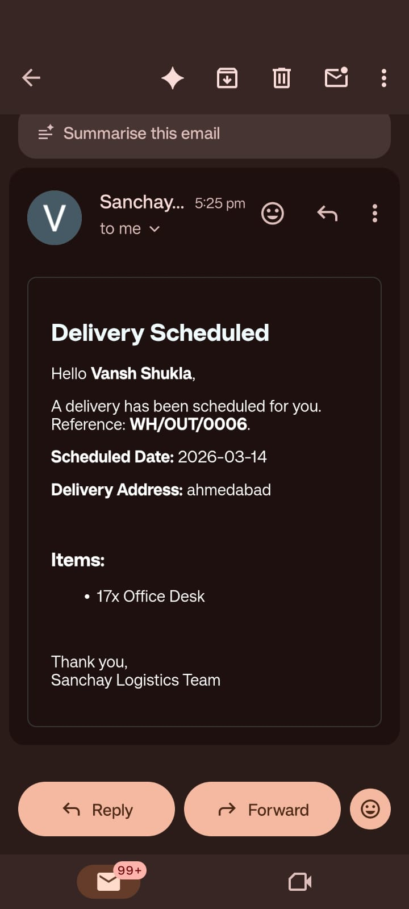
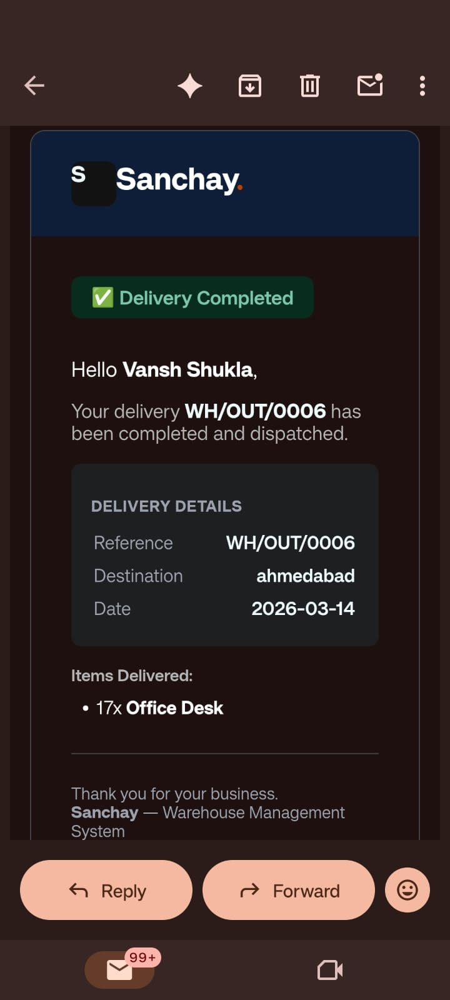

> Inventory Management System built for **Odoo × Indus University Hackathon 2026**

---

## What is Sanchay?

Sanchay is a full-stack warehouse management system that helps businesses track incoming and outgoing stock, manage products, and monitor inventory movements — all in real time.

It includes an **AI-powered chatbot** that lets users perform warehouse operations using plain English instead of filling forms.

---

## Features





- **Authentication** — Secure login, registration, JWT-based sessions
- **Dashboard** — Live stats: pending receipts, deliveries, stock levels, recent operations
- **Receipts** — Log incoming goods from vendors, auto-update stock on validation
- **Delivery Orders** — Log outgoing shipments, stock decreases on validation
- **Move History** — Complete audit log of all inventory movements (IN/OUT)
- **Stock Management** — View and edit product stock levels with inline editing
- **Warehouse & Locations** — Manage multiple warehouses and storage locations
- **AI Chatbot** — Natural language commands powered by Claude claude-opus-4-5
- **PDF Download** — Download formatted receipt/delivery documents

---

## Tech Stack

| Layer | Technology |
|---|---|
| Frontend | React + Vite |
| Backend | Node.js + Express |
| Database | PostgreSQL |
| Auth | JWT + bcryptjs |
| AI | cohere API Key |
| PDF | jsPDF + jsPDF-AutoTable |

---

## Getting Started

### 1. Clone the repo

```bash
git clone https://github.com/your-username/coreinventory-hackathon.git
cd coreinventory-hackathon
```

### 2. Setup Backend

```bash
cd backend
npm install
```


```bash
npm run dev
```

### 3. Setup Frontend

```bash
cd frontend
npm install
```

Create `frontend/.env`:
```env
VITE_API_URL=http://localhost:3000
```

```bash
npm run dev
```

Open `http://localhost:5173`

---

## Project Structure

```
coreinventory/
├── 
│   └── src/
│       ├── pages/          # All page components
│       ├── components/     # Shared components + ChatBot
│       └── utils/          # PDF generators, axios instance
└── server/
    ├── middleware/             # All API routes
    ├── routes/           # Claude AI service
    └── middleware/         # JWT auth middleware
```

---

## AI Chatbot

The chatbot understands natural language commands like:

> *"Add receipt for 50 steel rods from Supplier A"*
>
> *"Create delivery for 10 chairs to Customer B"*
>
> *"How many chairs do we have in stock?"*

Claude extracts the intent and data, shows a confirmation card, and creates the record on confirmation.

---

## Team

Built by **[Sanchay WHMS]** — B.Tech AI & Data Science, Indus University

| Name | Role |
|---|---|
| Satyam Kadavla| Full Stack |
| Dev Bhavsar | Frontend |
| Vansh Sukla | Backend |
| Chirag | UI/UX |

---


*Odoo × Indus University Hackathon 2026*
